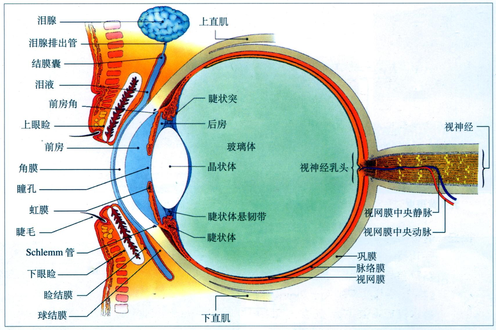
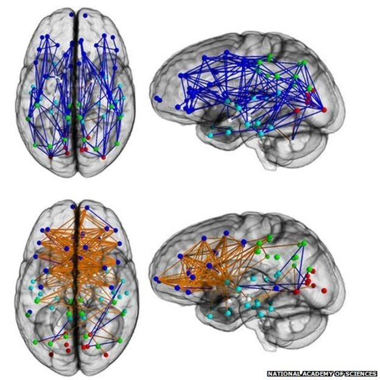
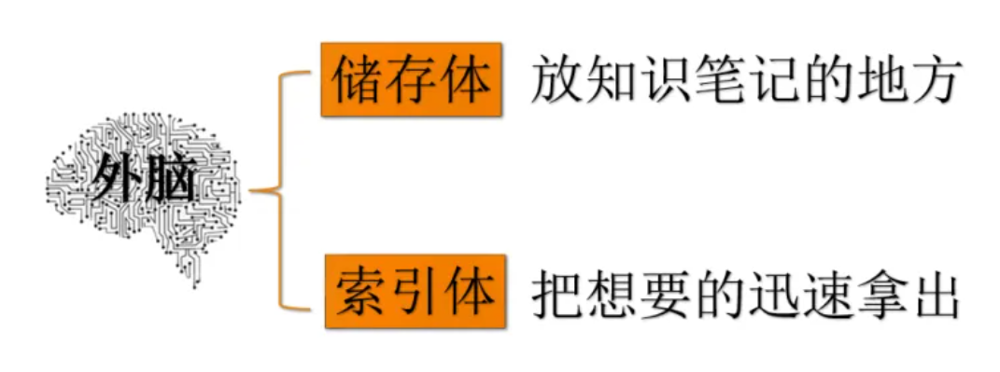
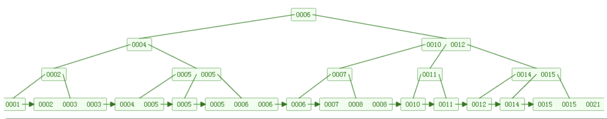

## 小恐龙和大坟墓

在我小学的时候，学校每周都会组织阅读课，把我们带到一个堆满二手书的屋子看书。当然我大部分时间都在看《葫芦娃大战金刚狼》、《蜘蛛侠和白雪公主》和《孙悟空 VS 变形金刚》这样的书了。直到我有一天扫到了角落里的一本书，那本书还很干净，这间接证明这本书远没有金箍棒与聚能炮对小豆包的吸引力强。不知怎么的，我翻开了那本书。

这本书讲得是三叠纪的恐龙，就是一页介绍一种恐龙的那种小百科。我当时觉得很神奇，因为我认为那些奇形怪状的东西，比如说葫芦娃、金刚狼、擎天柱，都是假的（没错，我就是这么聪明）。而这本书里介绍的恐龙有着和威震天一样的身高，远比猪八戒可怖的外貌，但是却是真实存在的！就在，就在从我的左手小指头数到我的右手食指的那么多个零年前！

距离我我第一次知道有恐龙这种生物已经过去快 15 年了，我依然清楚得记得当时的情形，以至于现在回想起来右手食指还在轻微抖动。那是我第一次意识到死亡这个概念，就是有个东西，它可能完全超越了某个时空下某个意识体的认知，然后就没了，就好像从来没有存在过一样。恐龙，很高、很大，然后没了。恐龙既没有儿子，也没有孙子，就彻底没了！

我有一天也会没有的，就算我有儿子，我的儿子有孙子，但是总有一天他们也会没有的！再过去从我的左手小指头数到我的右手食指那么多年，我会彻底消失的！

吾以天地为棺椁，以日月为连璧，星辰为珠玑，万物为送賷。这么大的阵仗，只告诉我一个事情，这是一个埋葬我的大坟墓！我不可避免地要被这座大坟墓吞噬掉！

但是！恐龙还没有彻底消失！因为它还活在那本书里，就是那本放在《蜘蛛侠和白雪公主》旁的书。我翻开了它，我轻轻念出了它：

> 莱森龙
> 
> 三叠纪
> 
> 蜥臀目
> 
> 阿根廷
> 
> 巨型恐龙，体长10米

当你看到这些文字的时候，你也知道三叠纪有种恐龙叫做莱森龙，没准还能记住它，这个服务器我们租了一年，莱森龙可以在这里最少活 350 多天。

这就是我看待文字或者笔记的本初的意义，它和知识体系的构建、办公的需求、分享无关。它只是和存在有关，如果我不写下它们，没有人可以证明那个大坟墓中曾经有一个东西曾经存在过。

于是，我开始写东西，有的时候是为了我的存在，有的时候是为了小恐龙的存在……

## 眼睛和脑子

我学解剖学的时候，注意到一个很有意思的东西。下图是一个眼睛的解剖图，可以看到视神经像电缆一样整齐漂亮，我们用这个东西读入信息的时候，信息是线性输入的，就和电报一样，是可以打在一个纸带上的。

但是我们的脑神经的解剖图是这样的，错综复杂，能让密集恐惧症患者恶心一辈子，“混合的、有权的、有环的复杂图”。

当我们读入信息的时候，我们是通过一种线性结构，而我们储存信息和检索信息，却是以一种更加复杂的方式。

那么笔记应该是什么样子的？

笔记应当是思考的模样。而思考，应该不是线性的，我们又不是图灵机。所以笔记有各级标题，有各个段落，有列表，有思维导图式，有引用的笔记。

很多人不喜欢记笔记，或许有一种原因是，笔记是对于思考的模拟，而思考是将一个线性结构转换成复杂结构的过程，这是一个秩序化的过程，而秩序化，需要能量。

我们开发的笔记软件，应该提高这两种结构的转化效率。

## 记忆和查找

小时候我很讨厌一个小孩儿，因为那个小孩每每饭局都会展示自己可以背诵圆周率到后 200 位，然后就会被冠以聪明的标志，然后他就会吃掉饭桌上最大最好吃的那块肉！太讨厌了！

话说为什么背诵圆周率就会被视为聪明的标志？我现在觉得，是因为圆周率是无意义的线性结构，背诵圆周率就真的是在检测自己脑子神经的带宽。但是人们不是这么组织知识的，人们会把不同的知识分类，比如数学、物理、生物、化学。然后在对每个学科细分，比如物理会分成力学、光学、电磁学、近代物理，然后再细分，比如力学里面有牛顿三大定律之类的。我见过很多人，他们虽然背不过 200 位的圆周率，但是他们却可以背过很多的物理公式，这些物理公式的长度连缀起来绝对超过 200 个字节了。我个人觉得是这个原因，因为知识被组织成了一种树状结构，这种结构会大大降低知识的无序性，所有的知识就像军队一样被组织起来。

树形结构真的是记忆的好帮手。

    

但是树形结构的检索效率呢？其实还是不够快的，对于一个线性结构，人们检索的效率是 O(N)，比如说你去问我童年的那个小孩，圆周率小数点后第 121 位是几？他需要一个个数完前 120 位才能有答案。但是如果你问我苹果的时什么花序？我的检索路径是“被子植物 -> 蔷薇科 -> 苹果亚科 -> 苹果属”，然后我会和你说苹果是伞房花序。这样看上去比小孩高明不少，我在一棵知识树上检索，我的效率是 O(lgN)。但是如果你问任何一个高二的生物竞赛生，他们都能立刻反应“是伞房花序”，而不是像我一样想这么久，因为他们都会做到这道题，记住这道题，一点也不难，他们的检索效率是 O(1)。

这种检索更像是一种哈希或者缓存。

所以我们应当怎么组织我们的知识，或者具体一点，怎么组织我们的笔记？是树形结构吗？那就检索得太慢了。是哈希吗？那就不够有秩序化。

或许 B+ 树的设计会给我们以启示，这种数据结构中兼具了树和链表的特性，同时也兼具了二者的优点。这应该也是我们笔记软件的特点，即笔记具有多种组织形式。

同时，笔记的组织形式间应当具有相互转换的能力，就好像如果经常停留在工作台上的物件，就应该直接焊接在工作台上。

## 榕树和江南

我记得和你说起过，我能看见那些东西飘在空中，就飘在我的眼前，就像榕树一样，枝化成了根，根长成了一棵新的榕树，榕树上有了新的须。那不是一棵静止的树，那棵树在运动，在野蛮生长，在不断向着未知的阳光前进，前进，前进到阳光晃得我看不清了。

那个东西，我相信，不止我能看见，你也能看见，对吧！