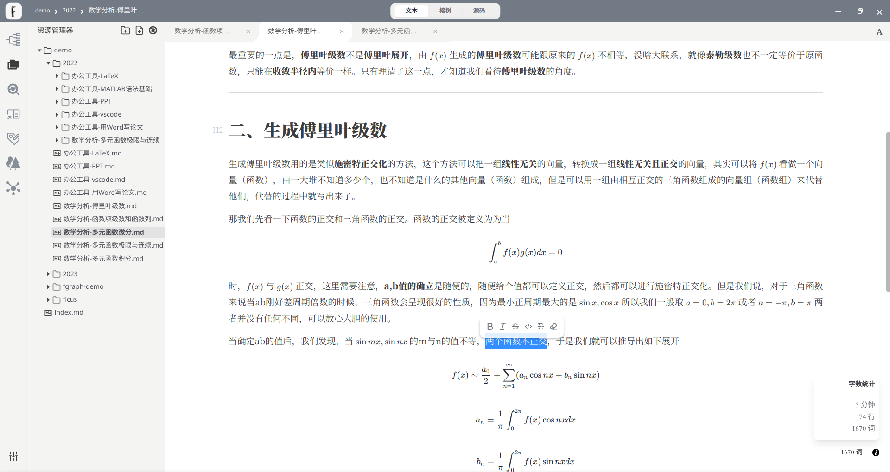

<h1 align="center">Ficus</h1>

Ficus 是一款 `markdown` 文档的编辑管理软件，由 gg=G 团队开发。

Ficus 释义为“榕树”，榕树具有“冠盖如伞、一木成林“的特点。这也恰是本款软件想要为用户提供的核心服务：让用户的 md 文档可以像一棵榕树一样被浏览和编辑，同时让用户的多个 md 文档像榕树林一样进行多种形式的关联。我们希望用户的体验如这款软件的标语一样：

Ficus 基于 `Vue3, Electron` 框架开发，提供 Windows、macOS 和 Linux 系统的安装包。
## 核心特征

### 独创性的 Ficus 架构

**ficus 架构**一共分为 3 个层次：

- 文档内：每个 md 文档都可以根据标题等语法符号解析成一个 **榕树 (ficus tree)**。
- 文档间：对多个文档进行结构化联合编辑，每个文档对应一棵树，多个文档组成 **榕林 (ficus forest)**。
- 文档库：将每个文档视为一个节点，并构建多样化的联系。组成成一个 **榕图 (ficus graph)**。

在文档内，榕树可以帮您更加详略得当地了解文档的组织结构，同时您可以通过编辑榕树调整文档的脉络，更加符合内容输出的直观逻辑。

在文档间，榕林为您拆分、嫁接、整合多棵榕树提供了可视化支持，您可以轻松拆分冗长的文档，构建有层次的文档，复用精彩文档。

在文档库，您可以构建多种文档间的联系，如榕根 (ficus root)，榕柱 (ficus prop)，榕须 (ficus aerial)。这些不同的联系能够帮助您进行更加有条理的文档管理、更加高效的文档检索、更加直观的思维导图构建、更加便捷的多文档联合编辑。同时您可以对这些联系进行编辑，是您可以直观地构建您自己的动态知识体系。

### 舒适自然的 md 编辑器

Ficus 内置“所见即所得”的 md 编辑器，支持以下功能特性：

- 所见即所得的实时渲染。
- `markdown` 语法高亮。
- 提供“源代码模式”和“渲染模式”的自由切换。
- $\LaTeX{}$ 数学公式渲染和补全支持。
- 查找替换功能。
- 编辑快捷键支持。
- 编辑悬浮窗。
- ……

### 简约慵懒的设计风格

Ficus 以用户为中心，会尽最大的努力来满足用户的期望，同时不增加用户的理解和使用负担。Ficus 风格具有以下特点：

- 思之繁，用之简。
- 一切都做到如此简洁明了，以至于没有任何需要解释的余地。
- 盛夏榕荫下的清凉与慵懒。

## 产品分析

### 产品速览

**富文本模式：**

**源码模式：**

**榕树：**

**榕林：**

**榕图：**

### 编辑能力的进击

Ficus 最突出的功能就是结构化编辑的能力，编辑的范围和方式都得到了十足的设计和拓展。文档不再是一个物理上线性的结构，无论是视图还是编辑，都可以以树的形式完成。文档间的联系也不再是单一得、只可读的，而是变成了多元的，可以随着用户认知的升级而动态发生转变的。

同时文档内部，文档间，整个文档库没有明显的逻辑界限，可以构成逻辑统一的“外脑”。

编辑能力可以用如下图概括：

### 产品对比

| 软件     | 现有缺点                           | Ficus 改进                         |
| -------- | ---------------------------------- | ---------------------------------- |
| Typora   | 收费、闭源、几乎没有笔记管理功能   | 免费、开源、提供强大的笔记管理功能 |
| Vscode   | 非程序员不友好、在笔记方面不够纯粹 | 所见即所得、用户友好               |
| Notion   | 繁琐冗杂、庞大、收费、反应慢       | 简约、轻量、免费、高响应性         |
| Obsidian | 粗糙的笔记管理功能                 | 更加细化的笔记管理功能             |
| MarkText | 对中文支持不好，停止维护           | 更好的中文支持，持续维护           |