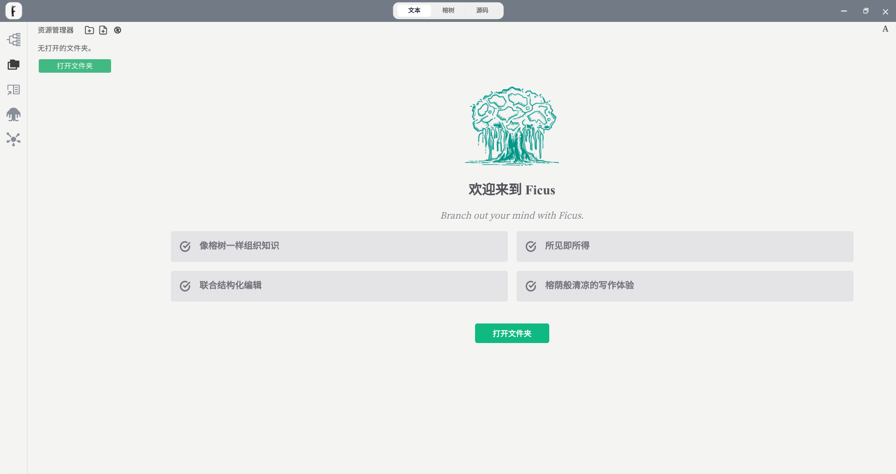

## 下载安装

您可以通过这个[页面](/pages/53ff34/)进行下载安装。

如果您使用的 windows，你需要选择 Ficus 的安装路径，如下所示：

我们会在桌面为您创建快捷方式，点击即可运行 Ficus。

## 使用

运行后原始界面如下所示，您可以选择一个工作区文件夹：

然后在侧边栏选择要编辑的界面，即可进行 markdown 的编辑：

在左上角的 ficus 图标可以点击，并展开菜单，可以完成全部工作：

在顶栏的面包屑、模式转换器，侧边栏的诸多类型，可以辅助您更快速地完成操作，请大胆尝试。