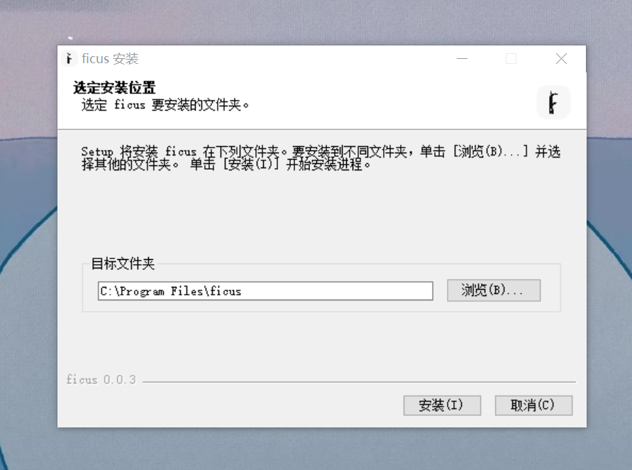

## 分区

可以被分成 3 个部分，即顶栏（红色），侧边栏（橙色），主区域（青色）。

## 顶栏 Header

- 点击左上角 logo 即可查看菜单
- 面包屑在“打开文件夹”模式下可以查看相对于工作区目录的路径，并且进行跳转
- 模式转换器可以切换文档的不同显示模式

## 侧边栏 SideBar

- 文档大纲：可以查看当前文档的标题并进行标题跳转
- 资源管理器：可以查看工作区目录的文档结构、打开需要编辑的文档、并进行基础的文件系统操作
- 引用与被引用：可以查看引用和被引用关系，并完成文档的打开
- 标签管理器：可以为文档设置标签、新建标签
- 榕图：可以查看文档间联系

## 主区域

- tab 栏：可以存储需要编辑的 markdown 文档，关闭编辑完成的文档
- 主区域：分为三种模式
  - 富文本模式：所见即所得
  - 榕树模式：可以浏览和编辑文章的架构
  - 源码模式：双栏布局，右侧为高亮 markdown 源码，右侧为渲染成果