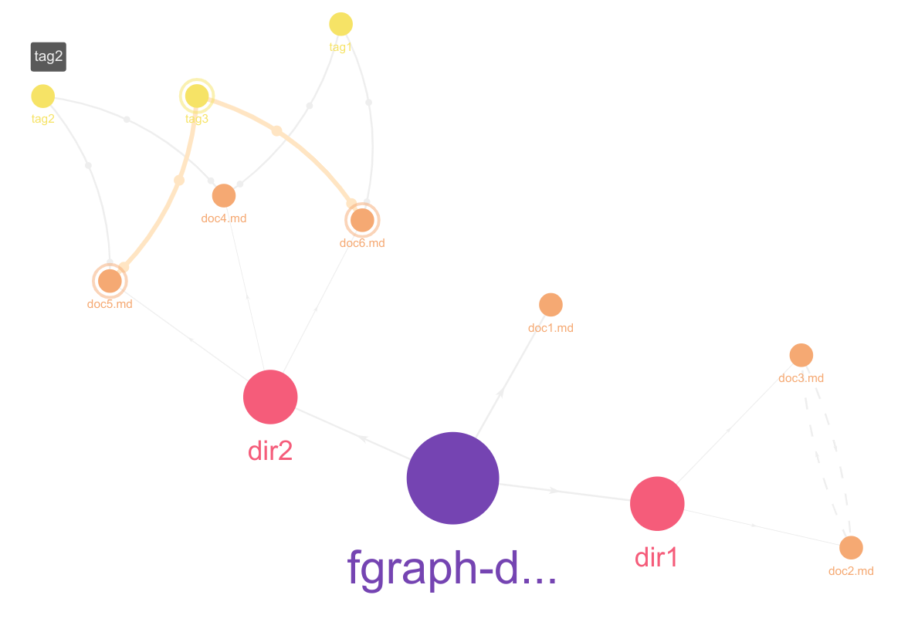

## 榕树模式

榕树模式是文档内的一种编辑模式，在这种模式下，文档会被展示成一棵结构化的榕树。

这棵树不仅有展示功能，您还可以通过拖拽对其进行编辑操作，所有的操作都会被同步到文档中：

- 平级交换：您可以互为兄弟的节点交换顺序
- 层次改变：您可以将标题类节点拖动到其他标题类节点上，此时这个节点会转变成目标节点的孩子

树的非叶子节点包括：

- 各级标题
- 列表虚拟节点（这是因为在 markdown 中没有像 latex 一样的 ``itemize`` 一样的总体结构）

树的叶子节点包括：

- 文本段
- 数学块
- 代码块
- 引用
- 列表
- 表格

需要注意的是，以下 md 实体并不是叶子节点：

- 加粗
- 斜体
- 下划线
- 链接
- 图片

对于如下 md 源码

```markdown
# 一级标题 1

## 二级标题 1

`int main(){return 0;}`

$$
1 = 1 + 1
$$

### 三级标题 1

一段文字

> 一段引用

## 二级标题 2
- item1
- item2
- item3
# 一级标题 2
```
生成如下 Ficus 树：


需要注意这是一颗有序树，也就是兄弟节点之间是有顺序的。

## 榕林模式

::: tip 敬请期待

后续功能将在 β 阶段开发

:::

## 榕图模式

::: tip 敬请期待

目前只开发了榕图的部分展示功能，将在 β 阶段开发榕图的联系编辑功能。

:::

您可以通过榕图查看和编辑文档间联系，文档间联系有三种类型：

- 榕根 (ficus root)：表示文档在文件系统中的组织关系
- 榕柱 (ficus prop)：文档与标签（tag）间的联系
- 榕须 (ficus aerial)：文档间的引用关系和被引用关系

您可以通过展示区上方的按钮来控制图上的节点类型，也可以通过将鼠标悬停某一节点，来高亮其他与之相关的节点。

### 榕根

榕根的本质是文件系统的关系，如果一个子文件或者子文件夹属于一个父文件夹，那么在父子之间就会存在一条榕根。

对于如下目录结构：

```shell
├── dir1
│   ├── doc2.md
│   └── doc3.md
└── doc1.md
```

应形成如下结构


榕根是一种 [MECE](/pages/b190d0/) 的体现，榕根是完全的树形结构，符合“不遗不漏”的原则。榕根的建立其实是归档的过程，将笔记按照唯一的原则进行归档，方便笔记体系的结构化。

### 榕柱

由单层 tag 组织起来的 Ficus 关系，一个 md 文档可以具有多个 tag。一个 tag 对应一个节点，所有具有该 tag 的文档与这个 tag 节点间都有一条边。可以被看做一种以 tag 为中心的星形图。

在上文中的目录结构，tag 情况如下：

- doc1.md: `2022`
- doc2.md: `2022` , `OS`
- doc3.md: `OS`

此时的 Ficus 柱（黑线）如图所示，这幅图上同时也展示了 Ficus 根：



可以在侧边栏中用标签管理器创建 tag，而且创建好的 tag 会显示在文档头部。

榕柱是一套标签系统，这套系统相对于榕柱，体系感会减弱，但是会更加适合知识的检索。

### 榕须

由拓展 md 语法 `-[ref_name](file_path)` 构建出的关系。这种关系是一种有向的关系，关系的两个端点分别是引用文档和被引用文档。

对于上文的示例，存在引用关系：

- [doc2.md](http://doc2.md) 引用 doc3.md
- [doc1.md](http://doc1.md) 引用 doc2.md

那么对应的 Ficus 须的结构如下所示（为图中的绿色线条）：


在侧边栏中查看文档的引用和被引用关系。