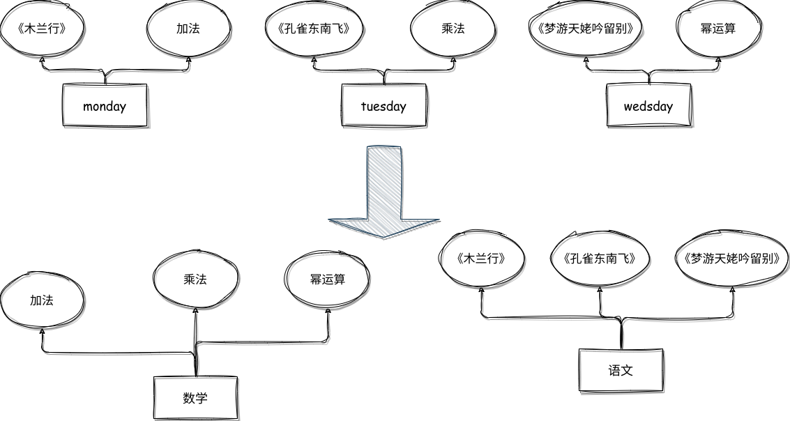
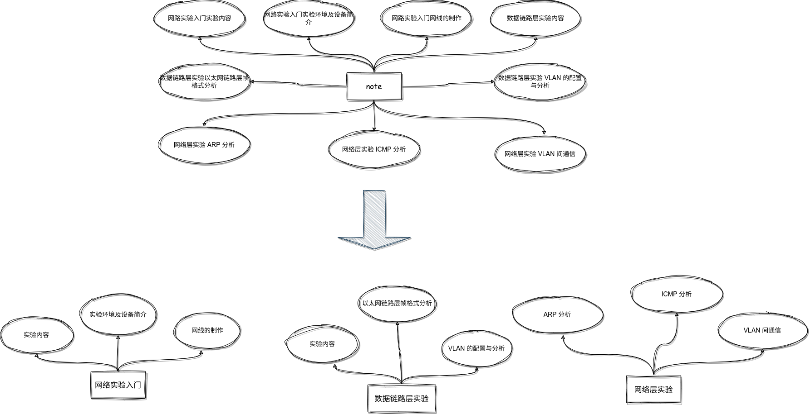

## 笔记内容过于零散

### 场景描述

阿榕平时很喜欢记笔记，每天都会将上课的收获记下来，有的时候中午追剧突然想到一个好的典故也会记录一下，但是笑笑却很不爱回看笔记，因为他的笔记都是这样的

```markdown
// monday.md
“唧唧复唧唧”原来有两种解释，一种是织布机，一种是木兰的叹息声。
1 + 2 = 3

// tuesday.md
“自挂东南枝”这个典故似乎被《探清水河》化用了诶。
3 * 10 = 30

// wedsday.md
“谢公屐”是谢灵运穿的。
2^10 = 1024
```

### 分析

每一天的笔记都是很细碎的，因为人们的感官系统决定了大部分人读入信息只能以“流水账”的方式进行，但是这种线性而且杂乱的笔记，显然是不方便让人回看的。

### 解决方法

利用 ficus 林功能，进行文档的合并



可以看到原本每天的“流水账”变成了数学和语文两个有逻辑的 md 文档。

## 笔记内容过于冗杂

### 场景描述

阿榕平时很喜欢记笔记，但是他习惯把所有的东西都寄到一个文档中，时间长了一个 md 文档有 1 万多字，用滚轮滑都要滑很长时间，他根本不想回看。他的笔记长这样（我们挑了一个结构很清晰的，实际上阿榕的笔记没有这么有条例）

```markdown
// note.md

# 网路实验入门实验内容
...
# 网路实验入门实验环境及设备简介
...
# 网路实验入门网线的制作
...
# 数据链路层实验内容
...
# 数据链路层实验以太网链路层帧格式分析
...
# 数据链路层实验 VLAN 的配置与分析
...
# 网络层实验 ARP 分析
...
# 网络层实验 ICMP 分析
...
# 网络层实验 VLAN 间通信
...
```

### 分析

人们在写笔记的时候是很难想清楚再动笔的，以一种模块化的方式去记笔记，就好像很多程序员喜欢 “一 main 到底”的程序设计思路一样，但是非结构化的笔记并不利于人们的反复观看和知识体系的构建。

### 解决方法

利用 ficus 林功能，进行文档的拆分。



可以看到原来 1 个文档被拆分成了 3 个有序的文档。

## 思路被体系限制


### 场景描述

阿榕是一个笔记狂人，有强迫症的他将自己的笔记管理得井井有条，但是有一天他面对罗素犯起了难。因为罗素既是一个数学家，也是一个哲学家，还是一个英国人！阿榕不知道要将罗素归到 `/理科/数学` 中，还是应当归到 `/文科/哲学` 中。

面对多分类问题，可以使用 fic tag 而不是文件系统

## 不知道如何构建体系

可以利用 fic prop 转换成 fic root 的功能进行体系化的构建，同时可以用 root 转 prop 进行撤销。

构建唯一的体系是必要的！

## 无法发现知识间的联系

可以用 fic aerail 转 prop 的功能，aerail 提供双链功能构建 tag