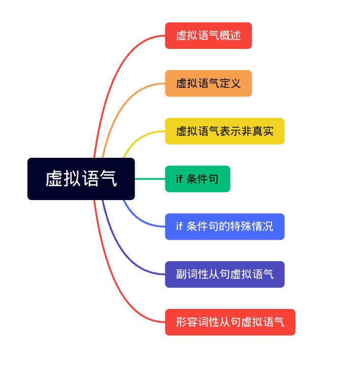
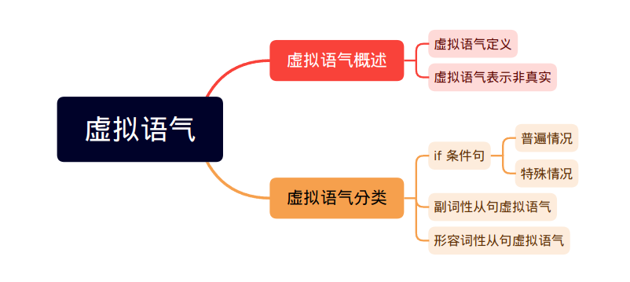
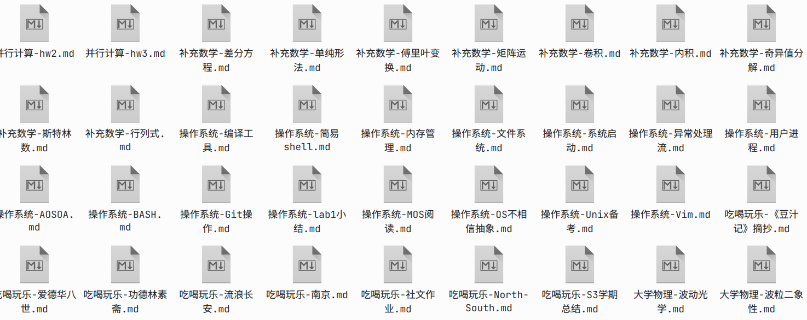
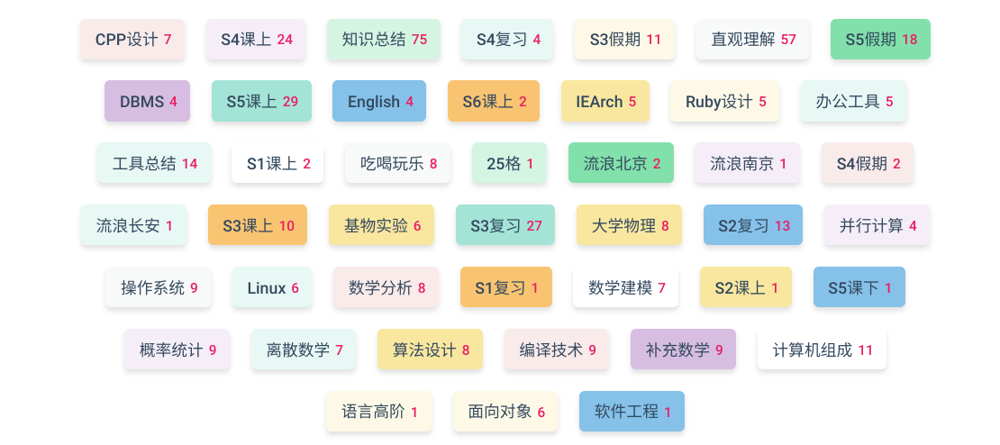
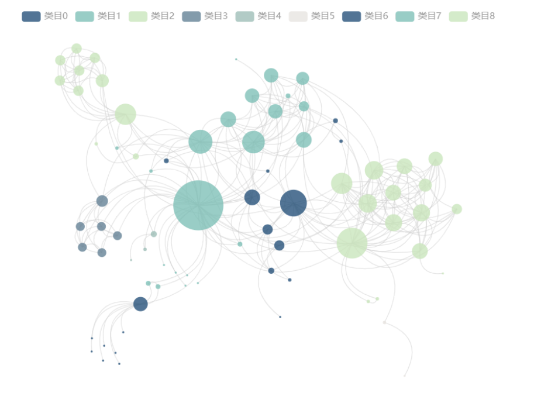
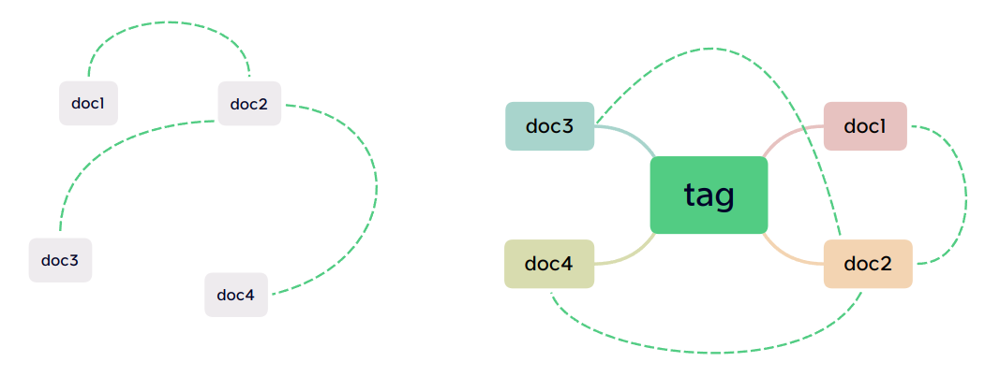
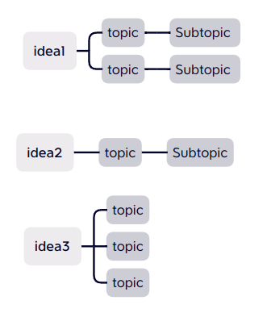
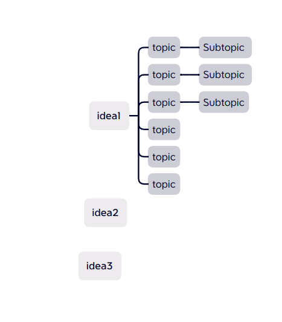
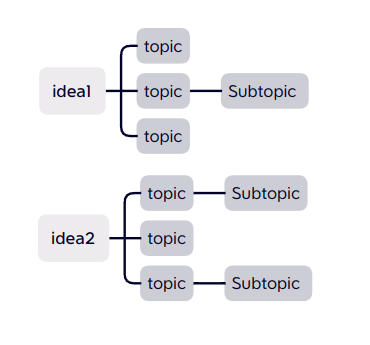

## 制作有条理的讲义

今天是天气晴朗的一天，Miss Zhang 打算开始她的工作，，一想到做 PPT 的时候要反复调整各种格式，她就头疼欲裂，学生还经常评论她的网课毫无条理，她感到十分委屈，英语的逻辑性本来就不强，自己已经尽可能地整理出逻辑了。

听她的男朋友说 Ficus 是一款很好用的软件，所以她决定试一试。打开界面后很像一个记事本，她了解到这是一个 markdown 的所见即所得的编辑器，但是她并不知道什么意思。她在写了一些内容后发现可以在导航栏处设置标题，被设置成标题的文字会变黑变大。

“这也和 word 没什么不同啊，只不过不用调整格式了，但是这种文本也没法给学生讲啊”，在她写完后不禁抱怨道。突然她注意到在右边有一个像榕树一样的图标，她尝试点了一下，发现眼前突然出现了这样的场景：

此时她的讲义中的内容完整地展现在她的面前，“原来我是这么平铺直叙的讲述啊，有些东西可以被归为一类的，人家还真是一个笨蛋美人呢”，然后她发现她可以在这个界面似乎可以调整她的结构，她尝试移动一下这些方块，发现是可以更改层次顺序的，就变成了这样

这样果然有条理了很多，而且她决定讲课的时候，就在这个视图下完成了授课，他发现这种树形结构真的超级有条理啊！

结束了授课后，她关掉这个界面打算开始整理讲义，她发现她的讲义已经被调整过了，所有的内容都按照在那个界面里的结构调整过了，所以她只花了很少的时间就完成了讲义的润色。

“我的男朋友真的推荐了一款好的软件啊，今天晚上节省下来的时间，就好好奖励他一下吧”，想到这里，Miss Zhang 嘴角流露出一股媚意，一步一摇地向着那个点起小灯的温暖卧室走去。

## 科学备战省赛

今天是天气晴朗的一天，张无雨早早到学校打算开始复习，还有五个月就要省赛了，自己的成绩还是很差。明明知识都是过了一遍的，但是每次遇到做题还是完全想不起来知识点。

“张姑娘，嘛呢？”，张无雨不用回头，就知道后面的那个冒失小子是诚哥。诚哥是班里的第一名，大家都说他是省队的苗子。“我怎么也记不住这些知识，你咋这么聪明啊”，诚哥虽然冒失，但是无雨并不讨厌他。“嗨，人能记忆的东西是有限的，最重要的不是完全记住，而是要记住找到记忆的方法啊”，诚哥俯下身，在草稿纸上画出一个像一棵树一样的结构，“你要把知识组织起来啊，不要让他们成为零碎的知识点，要像树一样组织啊，我推荐你一款软件，叫 Ficus，很好用的”。阳光打过来，张无雨看见了诚哥有点透明的褐色眼睛。

“Ficus 是吗？”张无雨回家下载了这款软件，似乎也没什么不同，她之前就用 markdown 写过笔记，所以直接用 ficus 打开了目录，“这似乎没有什么区别啊？“她发 QQ 问诚哥。“不不不，你看你的笔记，都是平铺的，还说知识点不零散”，无雨看了看，好像确实是这样的，她的笔记是这样的

“那应该是什么样子的呢？“无雨问道。“我教你啊，你可以给每个文章很多个 tag，这样自然而然就有条理了”，就像这样

“可是这样分类虽然检索速度快了，但是感觉还是有些乱啊”，无雨道。

“你可以用 ficus 的‘柱根转换‘功能，把比较稳定的柱转成根，这样你就可以新建很多文件夹，将文档正确归类啦，考试的时候就可以按照根的路径去回想就会很快！最后你的记忆就会被构造成我这样的”，诚哥发过来他的 Ficus 散点图视图，他认真的时候很难把他和那个白天的冒失小子联系起来。

五个月后，诚哥和无雨双双进了省队。

“张姑娘，我的 ficus root 是你啊”。

## 梳理研究进展

今天是天气晴朗的一天，秦斯睡了一个懒觉，昨天在实验室整理文献整理到了很晚，可是基本上还是没有成果。论文不断引用其他论文，而其他论文又引用论文，根本看不完啊！一想到这里，秦斯用枕头蒙住了头，根本不想起来。

“秦斯，吃饭啦！”，是王帅博，秦斯的同居男友，“烦死了，老子不吃不吃！”。秦斯一头钻进洗手间，重重地摔上门。

“好好好，都听少奶奶的”，王帅博对于秦斯总是无条件包容的，不过看见秦斯这么焦虑，他也想帮帮秦斯。

“小论文套大论文，大论文套大大论文，我这是读论文，不是诛论文九族！”，在饭桌上，秦斯一边嚼面包一边抱怨。

“要不我帮你做吧”王帅博说“我一直用一款叫做 ficus 的软件，很好用的”。

“就你？”秦斯眯起狐狸眼，王帅博盯着那双狡黠又迷离的眼睛，坚定地说道“：就我”。

。。。

秦斯从实验室回来，刚把靴子放在玄关的鞋柜上，就看见王帅博坐在沙发上捧着电脑看着她。秦斯心头一热，她这个男友，对她总是那么不厌其烦的，自己早上似乎为难他了。她朝帅博走去，边走边把发带从头上扯了下来。

“少奶奶你看，我弄好了”，“什么？你弄好了？”秦斯不相信自己的耳朵，“你是咋弄的”，帅博电脑上的文献都条目清晰的放在不同的文件夹里，而且帅博打开了一张漂亮的图，这个图里有很多密密麻麻的线和节点，他们指示了文档间的联系，有些联系是秦斯完全没有考虑到的。

“这样，用 ficus，把你的论文的引用文献都先用 ficus 须连接起来，然后在利用 ficus 的柱须转换功能，将它们转成 ficus 柱，这样文档间的联系就变得更加容易理解了，最后我利用根柱转换功能帮你整理了一下文件夹。“

后来，秦斯从身上扯下来的，就不止发带了。

## 打磨博文

今天是天气晴朗的一天，但是郭笑笑没有心情欣赏，她已经失眠了整整一晚上了。前写日子与一个漂亮的维族小男孩接连成长了好几个夜晚，“像鱼一样滑！”那几天郭笑笑想出了很多的点子。“只是”，笑笑拍了拍自己如烟絮般的头发，“这些东西怎么组织成一篇文章呢？”这个问题成了她失眠的罪魁祸首。

笑笑已经给每个点子都写了一篇 md 文档，但是这些文档很难被组织成一篇博文。

“或许可以试试 ficus”，这是那个小男孩推荐给她的，说是他的大学同学都用 ficus 做笔记。或许，使用这个软件可以找到一些“青春”的气息，就像那几个晚上一样，缪斯女神会再次垂青笑笑。想到这里，笑笑舔了舔嘴角。

用 ficus 打开那些文档，笑笑注意到侧边栏有一个 forest 的按钮，点开后笑笑发现界面上出现了很多的树形结构

或许将他们都放在一起会更好？笑笑拖动了这些树：

不对不对，似乎应当改变一下不同的部分的逻辑关系，笑笑摇了摇头，然后分成两篇文章：

这样似乎就好了，笑笑舔了舔嘴唇，是那种鱼一样的感觉。