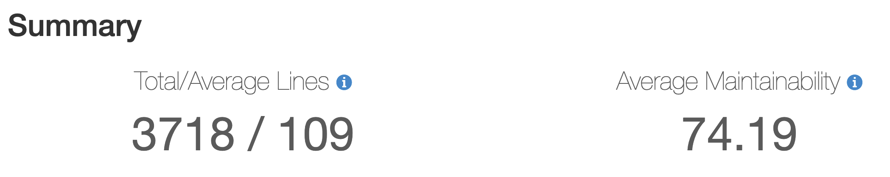
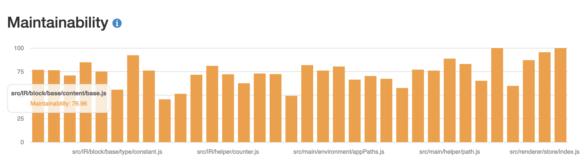
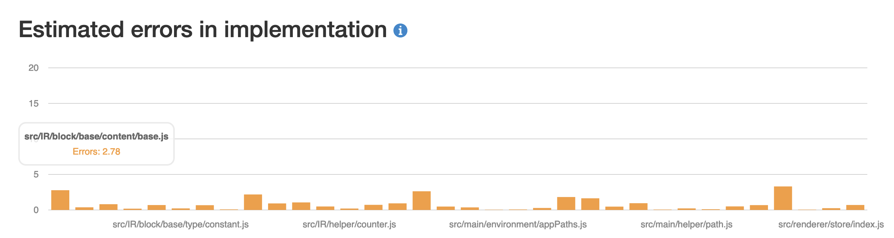
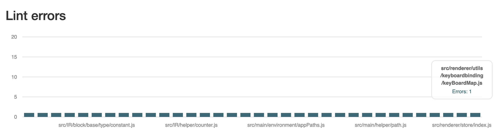
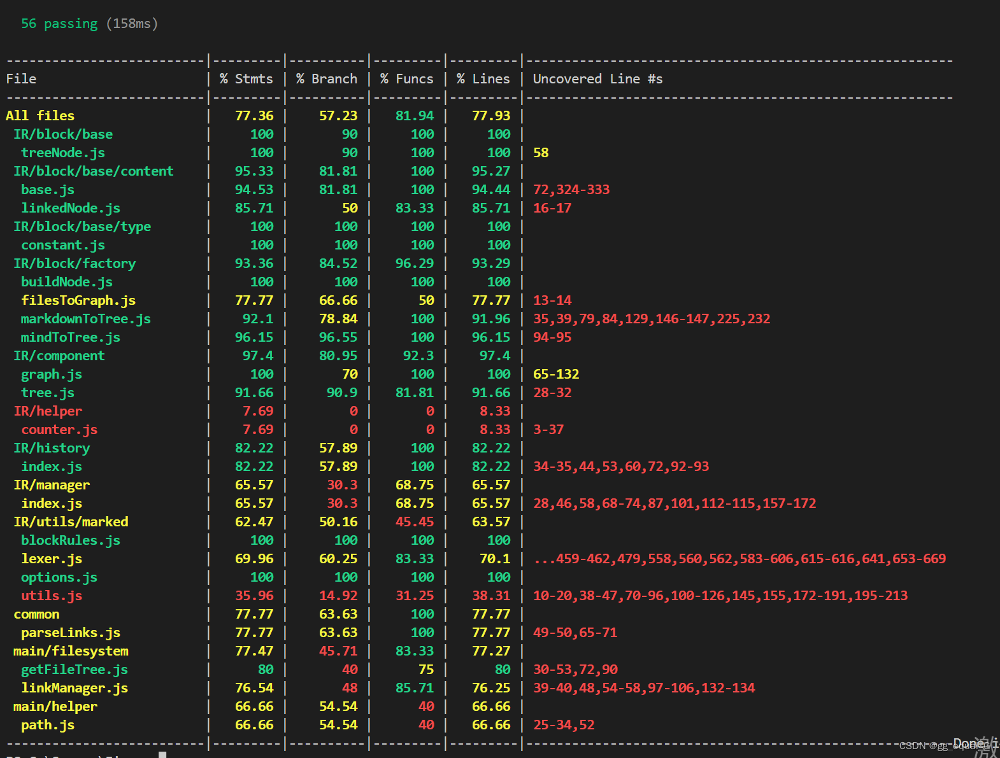

## 测试矩阵

| **平台信息**                                                 | **构建** | **基本MD编辑-富文本模式** | **基本MD编辑-源码模式** | **大纲视图** | **文件操作（正常）** | **文件操作（非法）** | **文件刷新** | **本地ficus链** | **网页超链接** | **引用计数** | **字数统计** | **场景测试-沈强** | **场景测试-郭笑笑** | **热更新** |
| ------------------------------------------------------------ | -------- | ------------------------- | ----------------------- | ------------ | -------------------- | -------------------- | ------------ | --------------- | -------------- | ------------ | ------------ | ----------------- | ------------------- | ---------- |
| Windows NT 10.0.22621.1555; x64                              | √        | √                         | √                       | √            | √                    | √                    | √            | √               | √              | √            | √            | √                 | √                   | √          |
| Linux 5.15.90.1-microsoft-standard-WSL2; ubuntu 22.04.2 LTS; x86_64 | √        | √                         | √                       | √            | √                    | √                    | √            | √               | √              | √            | √            | √                 | √                   | √          |
| Windows NT 10.0.22621.1555; x64                              | √        | √                         | √                       | √            | √                    | √                    | √            | √               | √              | √            | √            | √                 | √                   | √          |
| Linux 5.15.90.1-microsoft-standard-WSL2; ubuntu 20.04 LTS; x86_64 | √        | √                         | √                       | √            | √                    | √                    | √            | √               | √              | √            | √            | √                 | √                   | √          |
| Windows NT 10.0.19043.1381; x64                              | √        | √                         | √                       | √            | √                    | √                    | √            | √               | √              | √            | √            | √                 | √                   | √          |
| Windows NT 10.0.19044.1704; x64                              | √        | √                         | √                       | √            | √                    | √                    | √            | √               | √              | √            | √            | √                 | √                   | √          |
| Linux 5.15.108-1-manjaro; manjaro; x86_64                    | √        | √                         | √                       | √            | √                    | √                    | √            | √               | √              | √            | √            | √                 | √                   | √          |
| Linux 5.15.102-1-manjaro; manjaro; x86_64                    | √        | √                         | √                       | √            | √                    | √                    | √            | √               | √              | √            | √            | √                 | √                   | √          |
| Windows NT 10.0.22621.1546; x64                              | √        | √                         | √                       | √            | √                    | √                    | √            | √               | √              | √            | √            | √                 | √                   | √          |
| Macintosh OS X 10.14.6; Apple Silicon; arm64                 | √        | √                         | √                       | √            | √                    | √                    | √            | √               | √              | √            | √            | √                 | √                   | √          |

## 代码质量

#### 可维护性

总体上我们的[可维护性指标](https://learn.microsoft.com/zh-cn/archive/blogs/codeanalysis/maintainability-index-range-and-meaning)为74.19。比较而言，[marktext](https://github.com/marktext/marktext)该指标为65.94（共39497行，平均139行），[vscode](https://github.com/microsoft/vscode)该指标为56.23（共20281行，平均494行）。

同时，可维护性指标较低的代码基本上为markdown解析器代码，这部分实际上没有太好的质量优化空间。

#### 复杂度度量

在基于[Halstead复杂度度量](https://en.wikipedia.org/wiki/Halstead_complexity_measures)（包括[圈复杂度](https://en.wikipedia.org/wiki/Cyclomatic_complexity)）的错误估计上，我们平均可能错误数较少且分布均匀。

#### 代码规范

在代码规范上，我们所有的代码都满足我们使用的规范（'plugin:vue/vue3-essential', 'standard'）。（这里因为plato插件问题每个文件会多计算一个lint错误）

## 测试质量

我们使用mocha进行单元测试，并使用nyc计算代码覆盖率。覆盖率可以达到77.36%，大部分覆盖不到的代码为未使用或者guard性质的代码。

